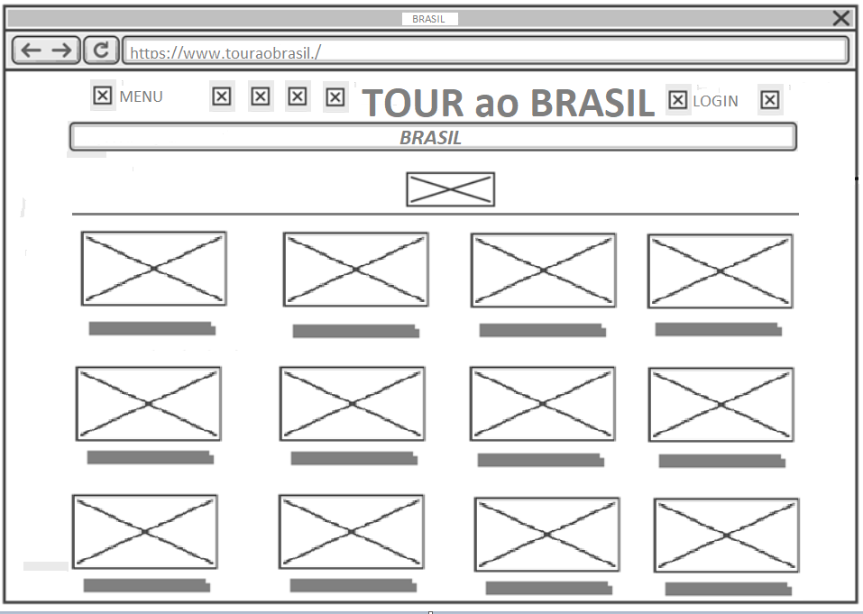
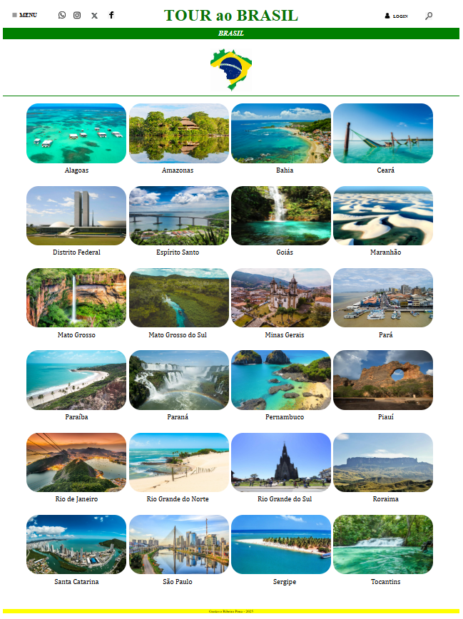

# Trabalho Prático - Semana 03

Dessa vez, vamos escolher uma proposta de projeto para trabalhar. Na [lista de propostas de projetos](propostas-projetos.md), escolha um dentre as alternativas.

Nessa atividade, você deverá montar a página inicial do projeto escolhido, a organização do HTML aplicando semântica correta e uso aprimorado do CSS. Leia o enunciado completo no Canvas para mais detalhes.

**IMPORTANTE:** Você deve trabalhar e alterar apenas arquivos dentro da pasta **`public`**. Deixe todos os demais arquivos e pastas desse repositório inalterados. **PRESTE MUITA ATENÇÃO NISSO.**

## Informações Gerais

- Nome: Gustavi Ribeiro Pena
- Matricula: 892106
- Proposta de projeto escolhida: Guia de Lugares Turísticos
- Breve descrição sobre seu projeto: Ao clicar em uma imagem, uma nova guia será aberta exibindo três pontos turísticos famosos do estado, com uma descrição e uma imagem de cada local. Ao clicar na bandeira de cada estado, outra guia será aberta, mostrando a distância e o local no Google Maps.

## Print do esboço criada

<<  >>

## Print da home-page criada

<<   >>
